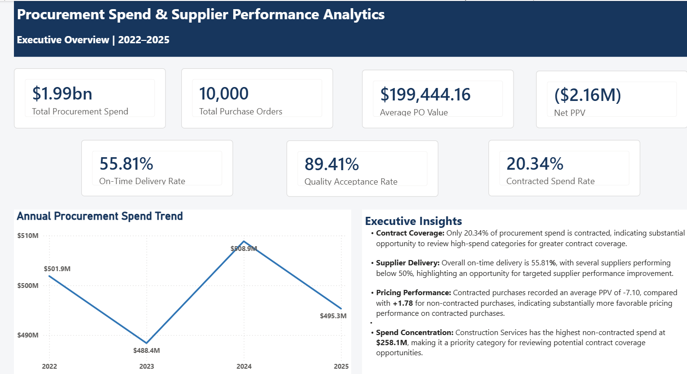
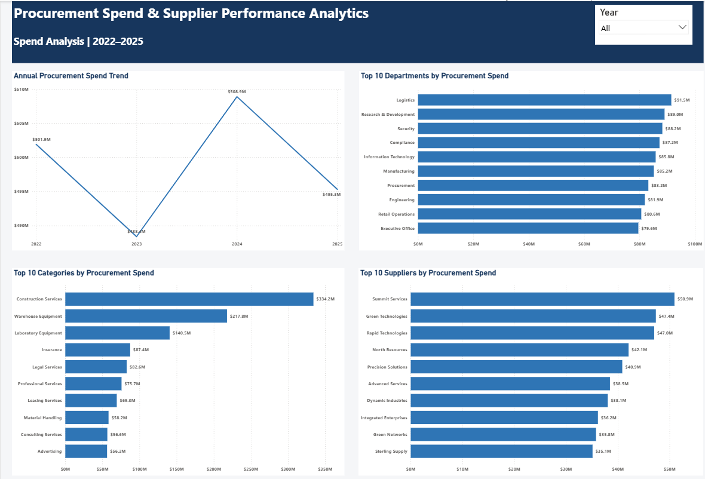
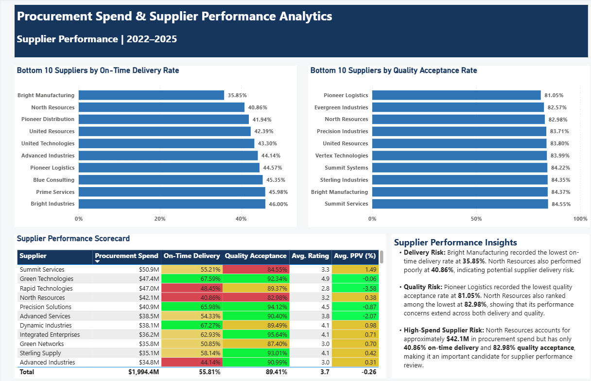
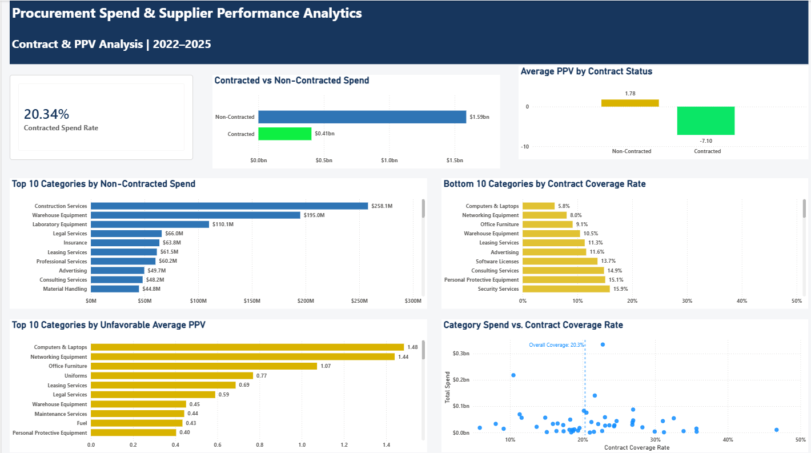

# Procurement Spend & Supplier Performance Analytics

## Project Overview

This project analyzes procurement spending, supplier performance, contract utilization, and purchase price variance (PPV) using SQL Server and Power BI.

The analysis focuses on identifying where procurement spend is concentrated, evaluating supplier delivery and quality performance, examining the use of contracted versus non-contracted purchasing, and identifying opportunities to improve sourcing and supplier management decisions.

The project uses a synthetic procurement dataset covering 2022–2025 and demonstrates an end-to-end analytics workflow from SQL-based data validation and analysis to interactive Power BI dashboards that translate procurement data into actionable business insights.

## Tools Used

- **SQL Server** — Data validation, transformation, joins, aggregation, and procurement analysis
- **SQL Server Management Studio (SSMS)** — SQL development and database management
- **Power BI** — Data modeling, DAX measures, interactive analysis, and dashboard development
- **Power Query** — Data preparation and data-type validation
- **Git** — Version control and project change tracking
- **GitHub** — Repository hosting, project documentation, and portfolio publishing

## Project Objectives

The objective of this project is to use procurement data to evaluate organizational spending patterns, supplier performance, contract utilization, and pricing performance to support data-driven procurement decision-making.

The analysis was designed to answer the following business questions:

1. How has procurement spending changed between 2022 and 2025?
2. Which departments, procurement categories, and suppliers account for the highest levels of spend?
3. Which suppliers show potential performance concerns based on on-time delivery and quality acceptance?
4. What proportion of procurement spend is contracted versus non-contracted?
5. How does purchase price variance (PPV) differ between contracted and non-contracted purchases?
6. Which procurement categories have high non-contracted spend or low contract coverage and may warrant further sourcing review?

## Dataset & Data Model

This project uses a synthetic procurement dataset designed to represent procurement activities across multiple departments, suppliers, products, contracts, purchase orders, invoices, and budgets.

The data was loaded into a SQL Server database named `ProcurementAnalytics`.

### Database Tables

The database contains eight tables:

- **Suppliers** — Supplier information, including supplier names and ratings
- **Departments** — Organizational departments and budget information
- **Products** — Product and service categories with pricing information
- **Contracts** — Supplier contract information, contract dates, and contract values
- **PurchaseOrders** — Purchase order transactions, including suppliers, departments, order values,  and delivery information
- **PurchaseOrderItems** — Detailed purchase order line items, including quantities, pricing, quality status, contract status, and purchase price variance
- **Invoices** — Invoice and payment information associated with purchase orders
- **Budgets** — Department-level budget information by year

The dataset contains **10,000 purchase orders** covering the period **2022–2025**.

### Data Model

The Power BI data model connects the procurement transaction tables with supporting dimension tables such as Suppliers, Departments, and Products.

Key relationships include:

- Suppliers → Purchase Orders
- Departments → Purchase Orders
- Purchase Orders → Purchase Order Items
- Products → Purchase Order Items
- Purchase Orders → Invoices
- Suppliers → Contracts
- Departments → Budgets

The model was structured to support filtering and analysis across procurement spend, suppliers, departments, product categories, contract utilization, delivery performance, quality performance, and PPV.

## SQL Analysis

SQL Server was used to validate the dataset and perform the core procurement analysis before the results were visualized in Power BI.

### Key SQL Tasks

The SQL analysis included:

- Validating record counts, purchase order dates, missing values, and duplicate purchase orders
- Calculating total and annual procurement spend
- Identifying the highest-spend departments, suppliers, and procurement categories
- Measuring supplier on-time delivery performance
- Measuring supplier quality acceptance performance
- Building a combined supplier performance scorecard
- Calculating contracted and non-contracted procurement spend
- Measuring contract coverage by procurement category
- Comparing purchase price variance (PPV) between contracted and non-contracted purchases
- Identifying high-spend suppliers with potential performance concerns
- Using joins, aggregations, `CASE` statements, CTEs, conditional calculations, and `GROUP BY` analysis

### SQL Script

The complete SQL analysis used for this project is available here:

[`Procurement_Analytics_SQL_Analysis.sql`](sql/Procurement_Analytics_SQL_Analysis.sql)

## Key Findings

### 1. Procurement Spend
- Total procurement spend across 2022–2025 was approximately **$1.99 billion** across **10,000 purchase orders**.
- Annual procurement spend remained relatively stable, ranging from approximately **$488.4 million to $508.9 million**.
- **Construction Services** was the largest procurement category, accounting for approximately **$334.2 million** in spend.
- **Logistics** was the highest-spend department at approximately **$91.5 million**.

### 2. Supplier Performance
- Overall on-time delivery performance was **55.81%**, indicating an opportunity for closer supplier delivery management.
- **Bright Manufacturing** recorded the lowest on-time delivery rate at **35.85%**.
- Overall quality acceptance was **89.41%**.
- **Pioneer Logistics** recorded the lowest quality acceptance rate at **81.05%**.
- **North Resources** represented approximately **$42.1 million** in spend while recording only **40.86% on-time delivery** and **82.98% quality acceptance**, making it a notable candidate for supplier performance review.

### 3. Contract Utilization
- Only **20.34%** of procurement spend was associated with contracted purchases.
- Approximately **$1.59 billion** was non-contracted spend compared with approximately **$0.41 billion** in contracted spend.
- **Construction Services** had approximately **$258.1 million** in non-contracted spend, the highest among the analyzed categories.
- **Computers & Laptops** had the lowest contract coverage rate at approximately **5.8%**.

### 4. Purchase Price Variance
- Contracted purchases recorded an average PPV of **-7.10 percentage points**, compared with **+1.78 percentage points** for non-contracted purchases.
- Under the PPV convention used in this project, negative PPV represents favorable pricing performance while positive PPV represents unfavorable pricing performance.
- The results suggest that contracted purchases were associated with more favorable pricing performance in this dataset, although the analysis does not by itself establish that contracting caused the difference.

## Power BI Dashboard

The Power BI report consists of four pages designed to provide both executive-level KPIs and detailed procurement analysis.

### 1. Executive Overview

Provides a high-level view of procurement spend, purchase order activity, supplier performance, contract utilization, PPV, and annual spending trends.



### 2. Spend Analysis

Analyzes procurement spending by year, department, procurement category, and supplier.



### 3. Supplier Performance

Evaluates suppliers using procurement spend, on-time delivery, quality acceptance, supplier ratings, and purchase price variance.



### 4. Contract & PPV Analysis

Examines contracted versus non-contracted spend, contract coverage by category, purchase price variance, and potential sourcing opportunities.



## Recommendations

Based on the analysis, the following areas may warrant management attention:

1. **Review supplier delivery performance** — Suppliers with low on-time delivery rates, particularly high-spend suppliers such as North Resources, should be reviewed to understand the causes of delivery delays and identify appropriate improvement actions.

2. **Strengthen supplier quality monitoring** — Suppliers with lower quality acceptance rates should be monitored more closely and evaluated for potential corrective action or supplier development initiatives.

3. **Evaluate contract coverage opportunities** — High-spend categories with low contract coverage, particularly Construction Services and Warehouse Equipment, should be reviewed to determine whether additional sourcing agreements could provide commercial or operational benefits.

4. **Investigate pricing performance** — The more favorable PPV observed among contracted purchases suggests that procurement teams should further investigate whether greater use of negotiated contracts could improve pricing outcomes.

5. **Prioritize high-spend, high-risk suppliers** — Supplier reviews should consider both financial exposure and operational performance so that management attention is focused on suppliers with significant spend and multiple performance concerns.

## Project Limitations

- The dataset used in this project is **synthetic** and was created for portfolio and analytical practice purposes. The results therefore do not represent the procurement activities of a real organization.
- The analysis focuses primarily on historical procurement transactions from **2022–2025** and does not include predictive forecasting of future procurement spend or supplier performance.
- Supplier performance was evaluated using available measures such as on-time delivery, quality acceptance, supplier rating, and PPV. Other factors such as supplier financial stability, ESG performance, risk exposure, and service-level requirements were not included.
- Non-contracted spend should not automatically be interpreted as unauthorized or maverick spending. Additional procurement policy and contract information would be required to make that determination.
- The relationship between contract status and PPV is observational. Although contracted purchases showed more favorable average PPV in this dataset, the analysis does not establish that contract usage caused the pricing difference.

## Repository Structure

```text
Procurement-Spend-Supplier-Performance-Analytics/
│
├── README.md
├── .gitignore
│
├── data/
│   ├── README.md
│   ├── budgets.csv
│   ├── contracts.csv
│   ├── departments.csv
│   ├── invoices.csv
│   ├── products.csv
│   ├── purchase_order_items.csv
│   ├── purchase_orders.csv
│   └── suppliers.csv
│
├── powerbi/
│   └── Procurement_Spend_Supplier_Performance_Analytics.pbix
│
├── screenshots/
│   ├── Executive_Overview.png
│   ├── Spend_Analysis.png
│   ├── Supplier_Performance.png
│   └── Contract_PPV_Analysis.png
│
└── sql/
    └── Procurement_Analytics_SQL_Analysis.sql
```

### Project Files

- **`sql/`** contains the SQL Server analysis used for data validation, spend analysis, supplier performance analysis, contract utilization, and PPV analysis.
- **`powerbi/`** contains the Power BI report used to build the interactive dashboard.
- **`screenshots/`** contains images of the four Power BI dashboard pages for quick viewing on GitHub.
- **`data/`** is reserved for information about the synthetic dataset used in the project.